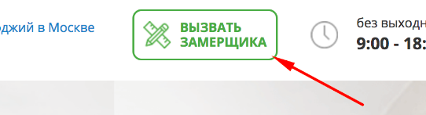
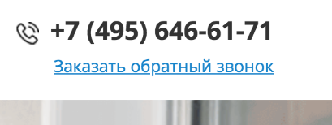
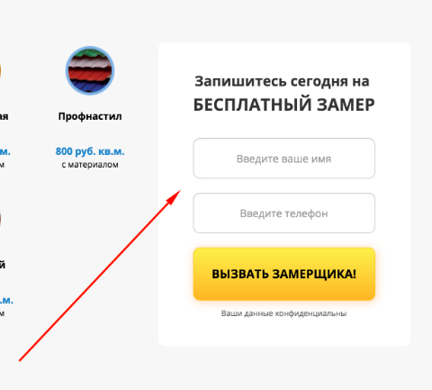
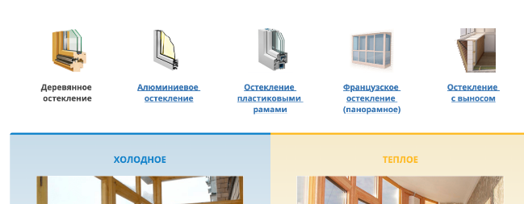
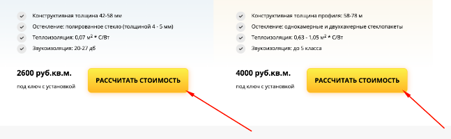
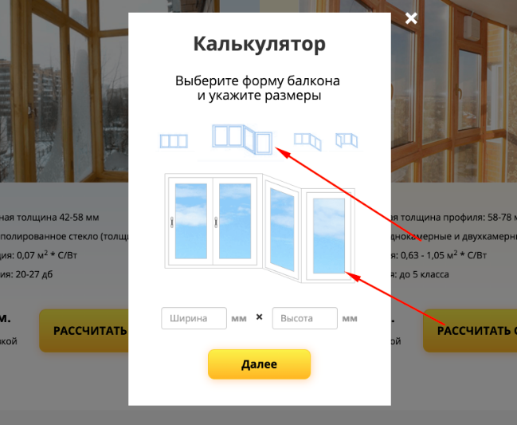
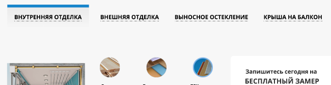
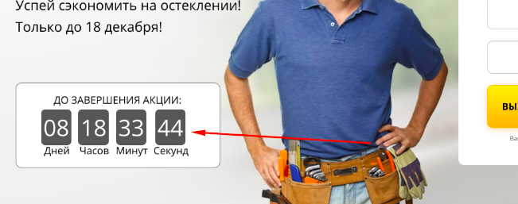
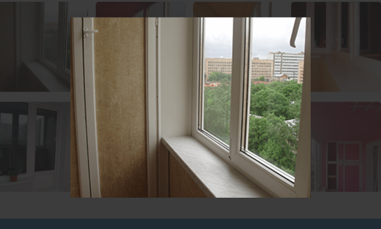

# irvas
Остекление балконов и лоджий в Москве и Московской области

## Техническое задание:

Условия:
- JavaScript код должен быть нативным, без использования библиотек, фреймворков или плагинов (напр. JQuery)
- В консоли должны отсутствовать любые ошибки
- Названия всех переменных/классов не должны содержать кириллицу или транслит. Никаких peremennaya
- Итоговый вариант должен быть построен на любой модульной структуре. В будущем планируем расширяться.
- Работоспособность во всех современных браузерах (Chrome, Firefox, Opera, IE11, Edge, Safari)
- Анимации очень приветствуются, но также остаются на усмотрение (установленные классы от animate.css можете менять как вам угодно
- Использование ES6+

### Список задач для реализации:

#### 1. При клике на эту кнопку:

 

Должно вызываться модальное окно (класс popup_engineer)

При клике на крестик или подложку - исчезать.

#### 2. При клике на эти надписи:

“Заказать обратный звонок” и “Спросите у нашего специалиста”

 

 

Должно вызываться модальное окно (класс popup)

При клике на крестик или подложку - исчезать

#### 3. Внутри всех модальных окон есть форма.

Она должна отправляться посредством ajax(без перезагрузки страницы) и захватывать все введенные данные. Также необходимо оповестить пользователя о состоянии отправки (идет отправка, отправлено, ошибка). В поле с телефоном можно вводить только цифры.

#### 4. На странице есть 6 одинаковых форм обратной связи:

 

 

Все они должны отправляться посредством ajax(без перезагрузки страницы) и захватывать все введенные данные. Также необходимо оповестить пользователя о состоянии отправки (идет отправка, отправлено, ошибка). В поле с телефоном можно вводить только цифры.

#### 5. Должны быть реализованы табы:

Так же идет переключение активного таба и его стиля. (класс active)
Пользователь может кликнуть и на надпись и на картинку

#### 6. Внутри всех табов есть кнопки “Рассчитать стоимость”

При клике на них должно появляться модальное окно с классом popup_calc 
Как оно должно выглядеть:

Основная задача: при клике на маленькие превью (4 в ряд сверху) эта превьюшка(картинка) становится несколько больше. Под ними показывается картинка-аналог активной превью. При выборе другой - аналогичная логика. В верстке все готово - нужно только прописать логику.

В поля “ширина” и “высота” можно вписать только цифры.
При клике на кнопку “Далее” данное модальное окно скрывается. Появляется popup_calc_profile 

На этом окне реализовать, что можно выбрать только 1 профиль. Или холодное или теплое.
При клике на кнопку “Далее” данное модальное окно скрывается. Появляется popup_calc_end 
Здесь требования точно такие же как и в других формах. НО! Все данные, что отметил или выбрал человек должны быть переданы вместе с формой.

#### 7. Реализация табов:

Так же идет переключение активного таба и его стиля. (класс after_click)

#### 8. Реализация таймера: 

Дедлайн пока выставляйте любой.

#### 9. При клике на любую из восьми картинок - она открывается на весь экран с полупрозрачной, темной подложкой.

Как должно выглядеть:

При клике на подложку - все исчезает.
Здесь много вариантов реализации. Верстка отдельных блоков запрещена. Реализация на ваше усмотрение, но все делать через JS.

#### 10. Если пользователь на странице больше 60 секунд - должно появится модальное окно (popup). При нажатии на крестик или подложку окно исчезает. 

#### 11. Необходима модульная структура проекта, подключена должна быть сборка(bundle).

#### 12. Никакого дублирования кода. Не нужно привязывать к каждой кнопке отдельные действия. Воспользуйтесь функцией или циклами.

Обязательно тестируйте проект, чтобы не было багов поведения и несостыковок. Представьте себя на месте пользователя, который будет совершать неочевидные действия. Также и в консоли не должно быть ошибок.
